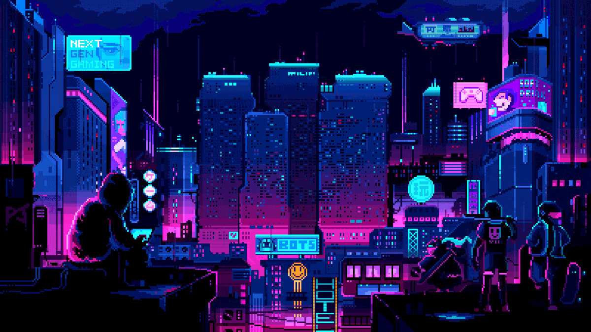

<h1 data-importer="text" align="left">Olá, tudo bem? 👋</h1>

###

Meu nome é Giovana e bem vindos ao meu perfil! 😊

###

<h1 data-importer="text" align="left">Minhas formações 🚀</h1>

###

- Sou Técnico em Informática 🖥   - No momento, estou cursando Tecnologia de Sistemas para Internet 📖   - Atualmente, estudo programação, com foco em Python, e em Desenvolvimento Web 🖥   - Tenho procurado trabalhar em projetos que envolvam a área de Desenvolvimento Web 👩‍💼

###

  

###

<h1 data-importer="text" align="left">Minhas experiências</h1>

###

Linguagens e tecnologias na qual tenho experiência e que já estudei 📗

###

  
  
  
  
  
  
  
  
  
  
  

###

<h1 data-importer="text" align="left">Meu Status:</h1>

###

    
    
    
  

###

<picture data-importer="pacman">
  <source media="(prefers-color-scheme: dark)" srcset="https://raw.githubusercontent.com/Giovana-carv/Giovana-carv/pacman-output/bomberman-contribution-graph-dark.svg?game=bomberman">
  <source media="(prefers-color-scheme: light)" srcset="https://raw.githubusercontent.com/Giovana-carv/Giovana-carv/pacman-output/bomberman-contribution-graph.svg?game=bomberman">
  
</picture>

###

###

  

###
